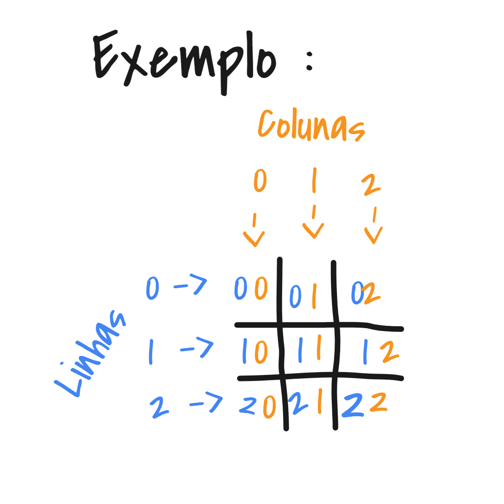

# tic-tac-toe
#️⃣ Projeto da disciplica de Técnicas de Programação

**Requisitos do projeto pode ser encontrado no arquivo [`RequisitosDoProjeto.md`](RequisitosDoProjeto.md)**

## Requisitos:
  * Windows
  * [gcc](https://gcc.gnu.org/)

## Compilação e Execução:
```bash
  git clone https://github.com/pdr-tuche/tic-tac-toe.git
  cd tic-tac-toe/src
  gcc -o exec.exe main.c
```
## Sobre o tic tac toe:

Tic Tac Toe (Também chamado de Jogo da Velha no Brasil) e um jogo para duas pessoas. No entanto, neste projeto, dei um jeitinho para os mais solitários conseguirem jogar...

>Algumas lendas urbanas contam que o jogo terá nascido em Portugal, na cidade de Almada no ano 545. No entanto, só foi popularizado no ano 1500, pelo descobridor Pedro Álvares Cabral, que adorava jogar este jogo durante as suas viagens. Álvares Cabral terá decidido que este jogo seria o primeiro a ser ensinado ao povo indígena no Brasil.

- fonte: [Wikipédia](https://pt.wikipedia.org/wiki/Jogo_da_velha)

### Objetivo
- O objetivo principal é formar uma linha com 3 peças iguais.(linhas horizontais, verticais e diagonais).

### Como Jogar
- Cada jogador deverá decidir qual peça, ele comandará ao jogar.
#### Jogando:
Cada jogador terá sua vez de jogar, devendo ocupar um dos nove lugares possíveis.
  - o jogador informará as coordenadas das casas numa relação de `Linha x Coluna`, conforme exemplo:

  


#### Ganhador:
O jogo continua até que seja formada uma linha respectivamente de 3 peças iguais.
Se todos os espaços tiverem ocupados, e ninguém conseguir formar a linha, a partida ficará no empate.

--------------

Você pode ve o programa funcionando no [youtube.](https://youtu.be/1CzSe8en04A)

E alguns cometários sobre o código [neste video.](https://youtu.be/LYai8qYWgZk)

