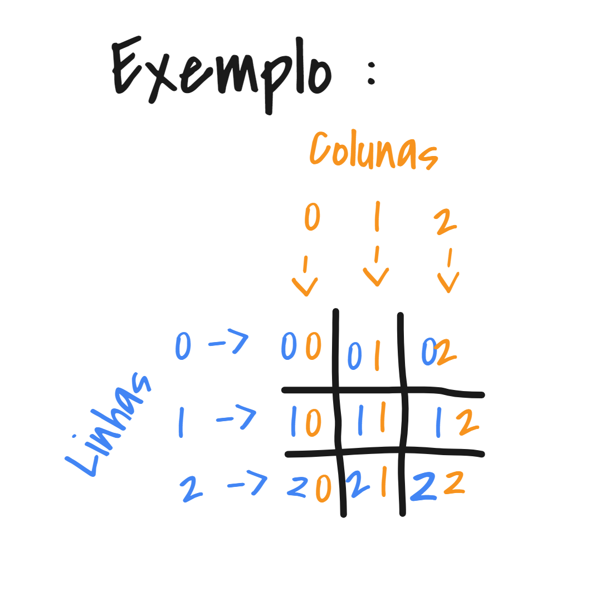

# tic-tac-toe
#️⃣ Projeto da disciplica de Técnicas de Programação

## Integrantes do projeto:
- Pedro Neves RGM: 28843410
- Jhennyfer Maria Lima Ferreira RGM: 30133289
- Joao Aldrin RGM: 30445604
- Daniel Fernandes RGM: 29535956
- Thiago Vasconcelos RGM: 22993479

**Requisitos do projeto pode ser encontrado no arquivo [`RequisitosDoProjeto.md`](RequisitosDoProjeto.md)**

## Sobre o tic tac toe:

Tic Tac Toe (Também chamado de Jogo da Velha no Brasil) e um jogo para duas pessoas. No entanto, neste projeto, dei um jeitinho para os mais solitários conseguirem jogar...

>Algumas lendas urbanas contam que o jogo terá nascido em Portugal, na cidade de Almada no ano 545. No entanto, só foi popularizado no ano 1500, pelo descobridor Pedro >Álvares Cabral, que adorava jogar este jogo durante as suas viagens. Álvares Cabral terá decidido que este jogo seria o primeiro a ser ensinado ao povo indígena no Brasil.
> - fonte: [Wikipédia](https://pt.wikipedia.org/wiki/Jogo_da_velha)

### Objetivo
- O objetivo principal é formar uma linha com 3 peças iguais. (linhas horizontais, verticais e diagonais). Onde é testado na função `verificaVencedor(char **m)` presente na linha 77 do arquivo `functions.h`
Codigo:
```C
int verificarVencedor(char **m){
        //linhas
    if(m[0][0] == 'X' && m[0][1] == 'X' && m[0][2] == 'X'){return 1;}
    if(m[1][0] == 'X' && m[1][1] == 'X' && m[1][2] == 'X'){return 1;}
    if(m[2][0] == 'X' && m[2][1] == 'X' && m[2][2] == 'X'){return 1;}

    if(m[0][0] == 'O' && m[0][1] == 'O' && m[0][2] == 'O'){return 2;}
    if(m[1][0] == 'O' && m[1][1] == 'O' && m[1][2] == 'O'){return 2;}
    if(m[2][0] == 'O' && m[2][1] == 'O' && m[2][2] == 'O'){return 2;}

//colunas

    if(m[0][0] == 'X' && m[1][0] == 'X' && m[2][0] == 'X'){return 1;}
    if(m[0][1] == 'X' && m[1][1] == 'X' && m[2][1] == 'X'){return 1;}
    if(m[0][2] == 'X' && m[1][2] == 'X' && m[2][2] == 'X'){return 1;}

    if(m[0][0] == 'O' && m[1][0] == 'O' && m[2][0] == 'O'){return 2;}
    if(m[0][1] == 'O' && m[1][1] == 'O' && m[2][1] == 'O'){return 2;}
    if(m[0][2] == 'O' && m[1][2] == 'O' && m[2][2] == 'O'){return 2;}

    //diagonais
    if(m[0][0] == 'X' && m[1][1] == 'X' && m[2][2] == 'X'){return 1;}
    if(m[0][2] == 'X' && m[1][1] == 'X' && m[2][0] == 'X'){return 1;}
    
    if(m[0][0] == 'O' && m[1][1] == 'O' && m[2][2] == 'O'){return 2;}
    if(m[0][2] == 'O' && m[1][1] == 'O' && m[2][0] == 'O'){return 2;}
    
    return 0;
}
```

Este trecho de código com certeza dá para ser melhorando colocando as condicionais dentro de uma estrutura de repetição. Porém nao tive QI o suficiente para implementar tal feito.

### Como Jogar
- Cada jogador deverá decidir qual peça, ele comandará ao jogar.
#### Jogando:
Cada jogador terá sua vez de jogar, devendo ocupar um dos nove lugares possíveis.
  - o jogador informará as coordenadas das casas numa relação de `Linha x Coluna`, conforme exemplo:

<div align ="center">
  
</div>

#### Ganhador:
O jogo continua até que seja formada uma linha respectivamente de 3 peças iguais.
Se todos os espaços tiverem ocupados, e ninguém conseguir formar a linha, a partida ficará no empate.

Esta lógica pode ser vista na função int `tictactoe()` presente na linha 107 do arquivo `functions.h`
```c
        vencedor = verificarVencedor(matriz);
        if(vencedor != 0){
            printf("\n O JOGADOR %d E O VENCEDOR !!! \n", vencedor);
            break;
        }
```
a funcao `verificarVencedor(char **m)` retorna `1` caso o jogador 1 seja o vencedor, `2` caso o jogador 2 seja o vencedor e `0` caso empate.

--------------
<div align ="center">

Você pode ve o programa funcionando no [youtube.](https://youtu.be/1CzSe8en04A)

[](https://youtu.be/1CzSe8en04A)

E alguns cometários sobre o código [neste video](https://youtu.be/LYai8qYWgZk) abaixo:

[](https://youtu.be/LYai8qYWgZk)

</div>

## Desafios:
Foi demasiadamente dificil ter que operar com ponteiros visto a necessidade de alterar valores por referencia e nao por cópia como é comumente feito nas utilizações de funções.
o uso de ponteiros foram utilizados principalmente para manipulção da matriz como se pode ve no trecho da função `mudarMatriz(int *a, int *b, char **m, int jogador)` presente na linha 48 do arquivo `functions.h`
```c
void mudarMatriz(int *a, int *b, char **m, int jogador){
    for (int i = 0; i < 3; i++)
    {
        for (int j = 0; j < 3; j++)
        {
            if(i == *a && j == *b){
                if(jogador == 1){
                    m[i][j] = 'X';
                }else{
                     m[i][j] = 'O';
                }
            }
        }
        
    }
    
}
```
Neste trecho se é interado os endereços de memoria que apontam para os vetores de caracteres de cada linha.

O conceito ideal para ser utilizado nesta situação seria a Aritimética de ponteiros. No entanto, ainda nao entendo a complexidade da aritimética, assim preferindo usar a notação tradicional de vetores bidimencionais para acessar os elementos.

#### Outra parte desafiante foi fazer o sistema de ranking.
Talvez, se por acaso do destino me sobre tempo e disposição para melhorar o sistema, criando a quantidade de vitorias de cada jogador ... será feito. Caso contrario, sinta-se a vontade de abrir um PR, no momento provavelmente eu estou com preguiça de fazer isso. Por isso optei pela solução mais facil, apenas anotar o nome dos vencedores
a função responsavel por esse feito é a `gravarNomeVencedor(char vencedor[20])` que encontra-se na linha 209 do arquivo `functions.h`
```c
void gravarNomeVencedor(char vencedor[20]){
    FILE *f;
    f = fopen("vencedores.txt", "a+");
    if (f == NULL) {
        printf("erro na abertura do arquivo\n");
        system("pause");
        exit(1);
    }

    int res = fputs(vencedor, f);
    fputc('\n', f);
    if (res == EOF)
        printf("erro na gravaçao\n");

    fclose(f);
}
```
Nesta função é criado o arquivo `vencedores.txt` caso nao exista e é salvo o nome do vencedor no inicio do arquivo.

Na função `initTicTacToe()` presente na linha 249 do arquivo `functions.h` é onde se é gravado o nome do vencedor como pode ser visto no trecho:
```c
res = tictactoe(); 
    
    if (res == p1.id){
        printf("Parabens %s !!!\n", p1.nome);
        gravarNomeVencedor(p1.nome);
    }else if(res == p2.id){
        printf("Parabens %s !!!\n", p2.nome);
        gravarNomeVencedor(p2.nome);
    }else{
        printf("\nDEU VELHA !");
    }
    
  ```
 Apos receber o retorno do tictactoe (1,2 ou 0) é verificado qual é o id correspondente ao struct do jogador, e logo apos gravado seu nome.

#
##### that's all folks!
